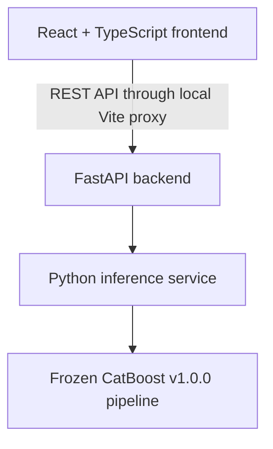
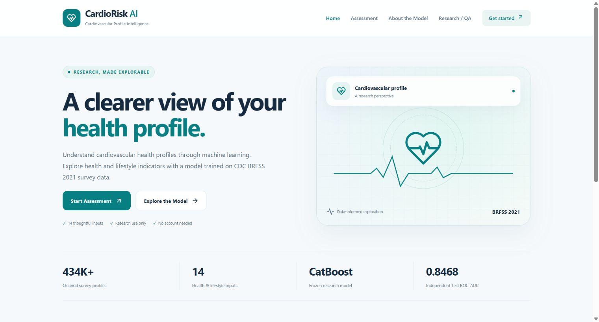
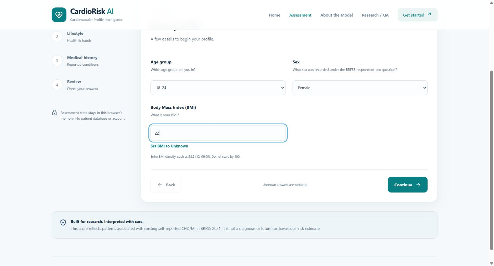
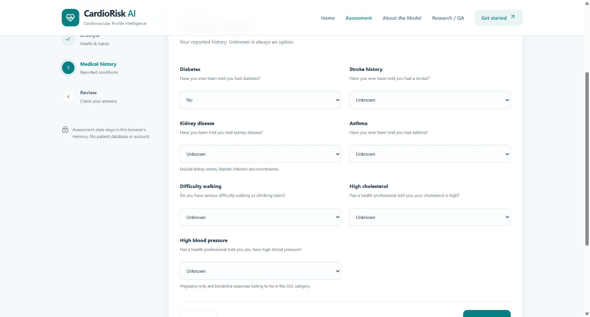
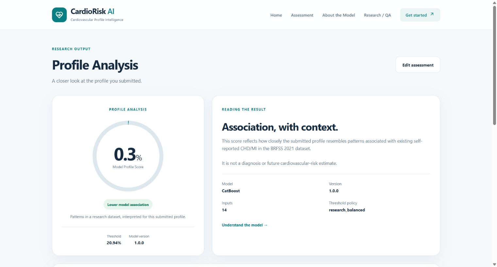
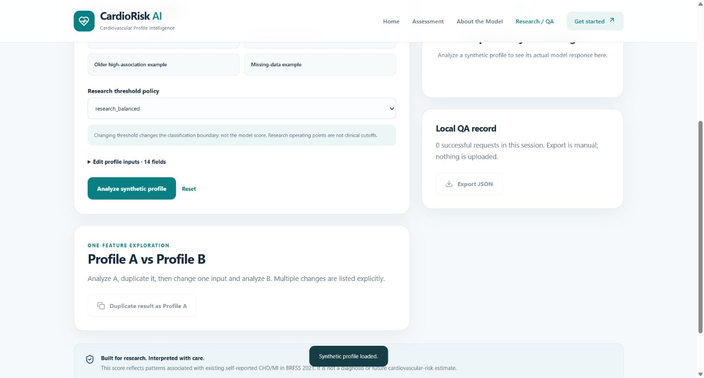
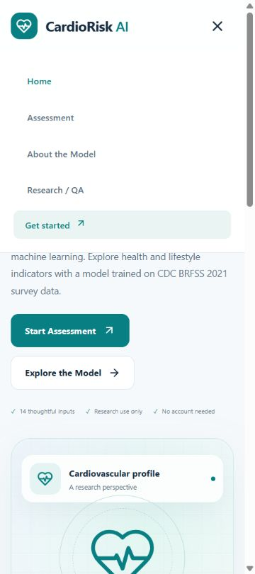

# CardioRisk AI — cardiovascular profile research

CardioRisk AI provides a frozen **CatBoost 1.0.0** model, FastAPI inference backend and a modern React research application. It classifies patterns associated with **existing self-reported coronary heart disease / myocardial infarction** in CDC BRFSS 2021 data. It is not a diagnosis, clinical screening tool or future cardiovascular-risk calculator.

## Run the local full-stack application

From the project root, using Python 3.12 and Node 22.12+:

```powershell
python -m venv .venv
.\.venv\Scripts\python.exe -m pip install -r requirements-api-test.txt
.\.venv\Scripts\python.exe -m uvicorn api.main:app --reload --host 127.0.0.1 --port 8000
```

In a second terminal:

```powershell
cd frontend
npm install
npm run dev
```

**Website:** http://127.0.0.1:5173/ · **API:** http://127.0.0.1:8000 · **API documentation:** http://127.0.0.1:8000/docs

In this workspace, portable Python and Node are installed under `../.runtime/`. Use `../.runtime/python/python.exe` for Python and add `C:\heart disease project\.runtime\node\node-v22.23.3-win-x64` to your terminal PATH for npm. Neither runtime is committed. The Vite dev server prints its URL and proxies `/api` to the loopback API; no CORS relaxation is required. [Frontend setup and test guide](frontend/README.md).

### Architecture and stack



React 19, TypeScript, Vite, Tailwind CSS 4, shared design tokens, Zod, React Router, Lucide icons, Vitest and Testing Library. Python, FastAPI and CatBoost retain the existing inference contract. No ML inference runs in React.

### Explore the application

| Page | Experience |
| --- | --- |
| Home | Research introduction, how it works, model highlights |
| Assessment | Four-step wizard: basic profile, lifestyle, medical history, review |
| Results | Model Profile Score, API classification, grouped submitted answers |
| About the Model | Dataset, 14 features, evaluation, thresholds, limitations |
| Research / QA | API status, synthetic presets, all five policies, profile comparison, technical JSON, manual JSON export |

Health profiles stay in browser memory. Unknown is null; invalid values are blocked. Regular assessment uses research_balanced. Thresholds are research operating points, not clinical cutoffs. No account, patient database or automatic upload is introduced.

### Screenshots



<details><summary>Assessment, review, results and research QA</summary>







</details>

All screenshots use synthetic inputs. [Responsive/browser QA](reports/model_qa/frontend_responsive_qa.md) · [Milestone report](reports/model_qa/react_completion_report.md).

The earlier standalone testing page is preserved in frontend/legacy and is available at `/testing/` after starting the updated API. React runs separately through Vite.

## Dataset preparation and reproduction

Obtain the official combined 2021 BRFSS SAS Transport dataset from [CDC](https://www.cdc.gov/brfss/annual_data/annual_2021.html). Raw/processed respondent datasets, split IDs and review rows are excluded from Git. The variable dictionary and safe aggregate reports are included. Source definitions are documented in [CDC sources](docs/sources.md) and [data dictionary](docs/data_dictionary.md).

Preparation uses variable-specific mappings, keeps missing predictors, excludes unusable targets and preserves labeled-record groups across seed-42 stratified 70%/15%/15% splits. Recorded counts: 434,058 supervised rows; train 303,841, validation 65,109, test 65,108. The cleaner begins with 16 candidates; the selected model uses the 14 below.

To reproduce training, follow [docs/training.md](docs/training.md) in a **separate fresh workspace**. It documents the raw filename/fingerprints, preparation command, split methodology, training, model selection, evaluation, random seed and expected broad metrics. Do not run reproduction to use or test the checked-in frozen model.

## Selected model and inputs

Candidate families included dummy, logistic regression, random forest, histogram gradient boosting, XGBoost, LightGBM and native CatBoost. Validation selection prioritized average precision alongside Brier score, feature-set uncertainty, missingness/subgroups and CPU inference. The unweighted, uncalibrated native CatBoost baseline without education/income was selected; its validation AP was 0.33936 and Brier score 0.06299. See [model selection](reports/modeling/model_selection_report.md) and [model card](reports/modeling/model_card.md).

The exact 14 inputs are:

```text
age_group, sex, bmi, general_health, physical_activity, smoking_status,
diabetes, stroke_history, kidney_disease, asthma, difficulty_walking,
high_cholesterol, high_blood_pressure, alcohol_use
```

Use the cleaned encodings in [model inputs](docs/model_inputs.md). BMI is human-readable (12–99.99); do not divide a website-entered value by 100. Smoking category 4 means fewer than 100 lifetime cigarettes, not necessarily never smoked. All four diabetes categories are retained. Unknown/null predictors use fitted missing-value processing. API category validation is strict; education, income, target and leakage fields are rejected.

Frozen artifact: `models/heart_disease_pipeline.joblib`, **182,048 bytes**, included in ordinary Git for immediate inference after cloning. SHA-256:

```text
4e313ef2810df2d4eb73c496db169cd963303da56abb9f1fa2e97522c21108f1
```

## Performance and research thresholds

Independent-test ROC-AUC **0.84676**, average precision **0.34479**, Brier **0.06254**, recall **51.55%** and precision **31.68%**, at approximately **8.14%** positive prevalence. The model has substantial false negatives and false positives. Cross-sectional survey labels do not establish future risk; no external clinical validation has been performed.

Default policy `research_balanced` uses **0.20943938491134126**. Other named policies are `youden`, `high_sensitivity_80`, `high_sensitivity_90` and `conventional_050`. Policies preserve the model score and change only classification threshold. They are research operating points, never medical cutoffs. See [thresholds](docs/thresholds.md) and [false-negative tradeoffs](reports/deployment/false_negative_tradeoff.md).

## API contract

Endpoints: GET /health, GET /ready, GET /model-info, POST /predict and POST /predict/batch. Startup verifies frozen artifact/supporting-file hashes and golden vectors before readiness. Example synthetic request:

```json
{"profile":{"sex":1,"bmi":28.5},"threshold_profile":"research_balanced"}
```

Responses include profile_score, association classification, threshold, policy and model version. See the [stable API contract](docs/api_contract.md), [backend configuration](docs/api.md) and `.env.example`. Environment files are not automatically loaded.

## Running tests and synthetic model QA

With API test dependencies installed:

```powershell
python -m unittest discover -s tests/api
python -m unittest discover -s tests/inference
python -m unittest discover -s tests/models
python -m unittest discover -s tests/artifacts
python -m unittest discover -s tests/frontend
python -m unittest discover -s tests
python scripts/run_model_qa.py
```

With the local server running and Node.js available for JavaScript tests only:

```powershell
node tests/frontend/test_app.cjs
```

Website-phase verification: 60 backend/model/artifact/pipeline tests, 9 Python frontend contract tests and 22 JavaScript tests passed. Synthetic QA covered 55 profiles, four missing-input cases and 56 boundary checks. [Browser verification](reports/model_qa/manual_browser_verification.md) confirms real Chrome submissions and CSV export. [Model behavior report](reports/model_qa/model_behavior_report.md) keeps qualitative observations marked REVIEW.

## Project structure

```text
api/          Existing FastAPI serving and request validation
frontend/     Native HTML/CSS/JavaScript model QA website
src/data/     Official mappings, inspection, cleaning and splitting
src/models/   Training, selection, calibration, evaluation and frozen inference
src/inference/Strict serving validation and shared frozen-model service
models/       Final artifact, schema, metadata and research policies
tests/        Backend, model, artifact, mapping and frontend tests
scripts/      Native startup, QA, reproduction and verification utilities
docs/         Definitions, client contract, reproduction and development log
reports/      Reviewed aggregates and synthetic QA evidence
```

## Development workflow and privacy

Each milestone requires automated tests, applicable browser verification, Git status and privacy/secret review before commit/push. No force push or final v1.0.0 release tag is part of the website milestone. See [development log](docs/development_log.md) and [version-control status](docs/version_control.md).

The ignore rules deny respondent-level data, candidates, prediction/SHAP arrays, training partitions, caches, credentials, manual notes and generated frontend output. Safe definitions, aggregate metrics, synthetic fixtures and the frozen artifact remain versioned. Do not weaken these exclusions for reproduction.

Readiness remains **READY FOR LOCAL RESEARCH USE**. Container verification is pending and is outside this website/version-control task. No deployment, external validation, model change or mobile work is performed in this phase.

## React milestone verification

```powershell
cd frontend
npm test
npm run build
cd ..
python scripts/verify_react_milestone.py
python scripts/run_model_qa.py
```

37 mocked React tests, 69 Python regression tests, 10 real Vite-proxy/API integration checks, and 55 synthetic behavior profiles plus 56 boundaries pass. The retained standalone JavaScript tests also remain available. Live integration requires both local servers; unit tests use mocked HTTP. The fresh-clone optional cached respondent audit remains skipped when excluded validation/cache files are absent.

## Application structure

```text
frontend/src/       React pages, components, API client, contract types, tests
frontend/legacy/    Preserved standalone testing page
api/               FastAPI routes and request safeguards
src/data/          CDC mappings and cleaning source
src/models/        Training/comparison/evaluation source
src/inference/     Frozen-model loading and inference
models/            Frozen runtime artifact and metadata
docs/screenshots/  Synthetic-only UI evidence
reports/model_qa/  Safe QA evidence; manual health notes stay local
```

No Docker, cloud deployment, external validation or mobile development was performed in this milestone. The model remains version 1.0.0.
